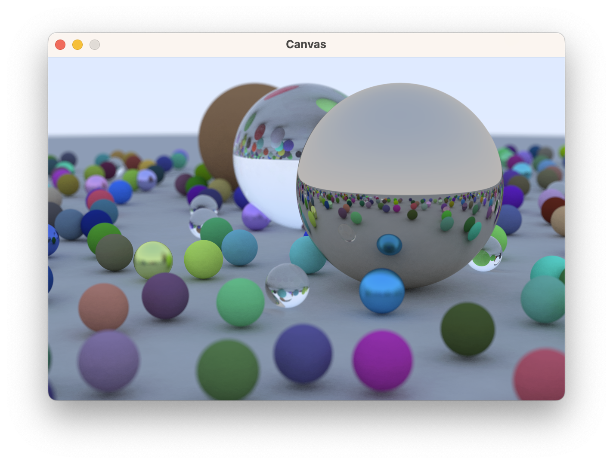

# Ray Tracing in One Weekend (in Roc)

[Ray Tracing in One Weekend](https://raytracing.github.io/books/RayTracingInOneWeekend.html) in Roc.

There's also a version [in Julia](https://github.com/shritesh/raytrace) and [Rust](https://github.com/shritesh/raytrace-rs).
